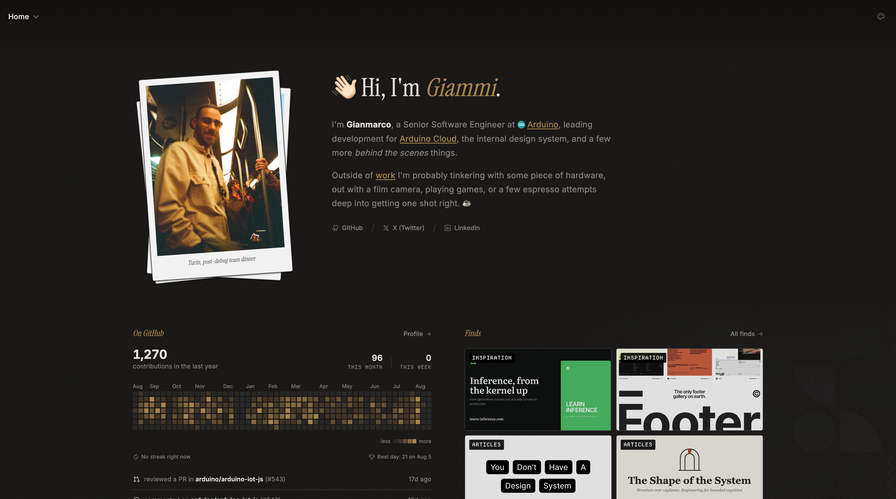

# freshgiammi/portfolio

My little corner of the internet: a personal portfolio and blog, home to the things I build, write, and find interesting.

## Tech stack

- [TanStack Start](https://tanstack.com/start) as the app framework with SSR and partial prerendering
- React 19, with [Base UI](https://base-ui.com) components and CSS modules (Sass) for styling
- [Vite](https://vite.dev) for the build, deployed to [Cloudflare Workers](https://developers.cloudflare.com/workers/) via Wrangler
- [content-collections](https://www.content-collections.dev) for MDX posts and thoughts
- [Storybook](https://storybook.js.org) for component development, including accessibility checks
