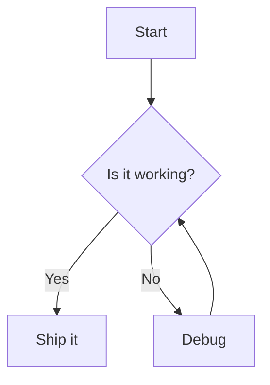
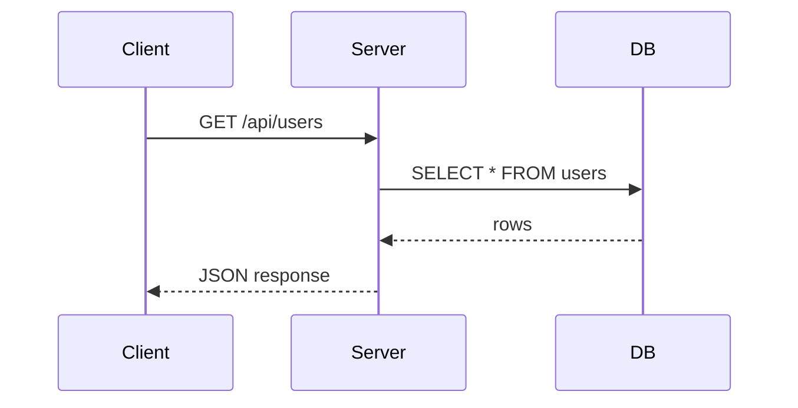
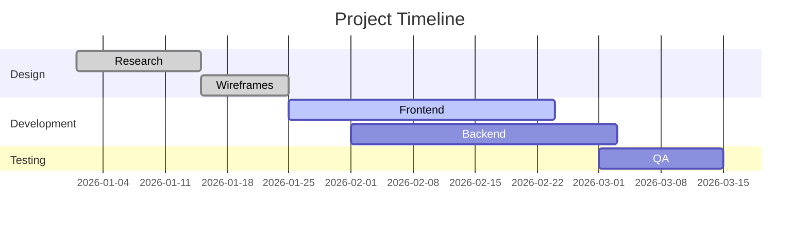

This post exists to verify every markdown rendering feature works correctly.

---

## Inline Formatting

**Bold text**, _italic text_, ~~strikethrough~~, `inline code`, **_bold italic_**.

Subscript: H~~2~~O, Superscript: E=mc^2^ (if supported).

---

## All Heading Levels

# H1 — Page Title (should only appear once per page)

## H2 — Section Heading

Lorem ipsum dolor sit amet, consectetur adipiscing elit.

### H3 — Subsection

Pellentesque habitant morbi tristique senectus et netus et malesuada fames ac turpis egestas.

#### H4 — Deeper Subsection

Vestibulum tortor quam, feugiat vitae, ultricies eget, tempor sit amet, ante.

##### H5 — Even Deeper

Donec eu libero sit amet quam egestas semper.

###### H6 — Deepest Level

Aenean ultricies mi vitae est. Mauris placerat eleifend leo.

---

## Blockquotes

> This is a blockquote.
>
> > Nested blockquote for testing.
>
> Back to the outer level.

---

## Alerts

> [!NOTE]
> Useful information that users should know, even when skimming content.

> [!TIP]
> Helpful advice for doing things better or more easily.

> [!IMPORTANT]
> Key information users need to know to achieve their goal.

> [!WARNING]
> Urgent info that needs immediate user attention to avoid problems.

> [!CAUTION]
> Advises about risks or negative outcomes of certain actions.

> [!NOTE]
> An alert can also span multiple paragraphs.
>
> Like this second one, with **bold** and `code` inside it.

---

## Lists

### Unordered

- Item one
- Item two
  - Nested item A
  - Nested item B
    - Deeply nested
- Item three

### Ordered

1. First step
2. Second step
   1. Sub-step A
   2. Sub-step B
3. Third step

### Task List (if supported)

- [x] Completed task
- [ ] Incomplete task
- [ ] Another task

---

## Code Blocks

### Plain text

```text
This is a plain code block with no language specified.
Line two.
```

### JavaScript / TypeScript

```typescript title="user.ts"
interface User {
  id: string
  name: string
  email: string
}

async function fetchUser(id: string): Promise<User> {
  const res = await fetch(`/api/users/${id}`)
  if (!res.ok) throw new Error("Failed to fetch")
  return res.json() as Promise<User>
}

const user = await fetchUser("abc-123")
console.log(user.name)
```

### Rust

```rust title="factorial.rs"
fn factorial(n: u32) -> u32 {
    match n {
        0 | 1 => 1,
        _ => n * factorial(n - 1),
    }
}

fn main() {
    let result = factorial(10);
    println!("10! = {}", result);
}
```

### Python

```python title="tree.py"
from dataclasses import dataclass
from typing import Optional


@dataclass
class Node:
    value: int
    left: Optional["Node"] = None
    right: Optional["Node"] = None


def inorder(node: Optional[Node]) -> list[int]:
    if node is None:
        return []
    return inorder(node.left) + [node.value] + inorder(node.right)
```

### Bash

```bash title="lint.sh"
#!/usr/bin/env bash
set -euo pipefail

for file in src/**/*.ts; do
  npx oxlint --fix "$file"
done

echo "Done!"
```

### JSON

```json title="package.json"
{
  "name": "freshgiammi-portfolio",
  "version": "3.0.0",
  "dependencies": {
    "react": "^19.0.0",
    "typescript": "^5.5.0"
  }
}
```

### Diff

```diff title="patch.diff"
- const x = 1
+ const x = 2
```

---

## Mermaid Diagrams

### Flowchart



### Sequence Diagram



### Gantt Chart



---

## Tables

| Feature | Support | Notes           |
| ------- | ------- | --------------- |
| Bold    | ✅      | `**text**`      |
| Italic  | ✅      | `*text*`        |
| Code    | ✅      | `` `code` ``    |
| Tables  | ✅      | Pipe syntax     |
| Mermaid | ✅      | Diagrams        |
| GFM     | ✅      | GitHub Flavored |

### Right-aligned columns

| Left  | Center | Right |
| :---- | :----: | ----: |
| One   |  Two   | Three |
| Alpha |  Beta  | Gamma |

---

## Links

- [External link](https://example.com)
- [Relative link](/blog)
- [Link with title](https://example.com "Example Title")

---

## Autolinks

Bare URL: https://example.com

Bare email: someone@example.com

---

## Line Breaks

Soft break — no trailing spaces, same paragraph:
this line should join the one above.

Hard break, two trailing spaces:  
this line should start on its own line.

---

## Images


---

## Embeds

Twitter's own embed snippet, pasted as-is. The `widgets.js` script that comes with it is dropped, and
the blockquote becomes a real component:

<blockquote class="twitter-tweet">
  <p lang="en" dir="ltr">
    just setting up my twttr
  </p>
  &mdash; jack (@jack) <a href="https://twitter.com/jack/status/20?ref_src=twsrc%5Etfw">March 21, 2006</a>
</blockquote>
<script async src="https://platform.twitter.com/widgets.js" charset="utf-8"></script>

A bare link on its own line does the same thing. This one carries a photo, a mention, and a link:

https://x.com/NASA/status/1546621144358391808

A link-only tweet, with no media at all:

https://x.com/tomwarren/status/1791368508111987198

And an older one, with a leading-dot mention and two links in the body:

https://twitter.com/NASA/status/574638915153362945

A tweet id that does not resolve falls back to a link rather than an empty card:

https://x.com/jack/status/1

---

## Horizontal Rules

Above

---

Below

---

## HTML Inline

This paragraph contains <span style={{ color: "var(--accent)" }}>accent-colored text</span> and a <kbd>Ctrl</kbd> + <kbd>C</kbd> keyboard shortcut.

---

## Definition List (if supported)

Term A
: Definition for term A

Term B
: Definition for term B
: Another definition for term B

---

## Footnotes (if supported)

Here's a sentence with a footnote.[^1]

[^1]: This is the footnote content.

---

## Escaping

Literal asterisks: \*not italic\*

Literal backticks: \`not code\`

---

## Mixed Content

Here is a paragraph with `inline code`, **bold**, _italic_, and a [link](https://example.com).

> A blockquote containing **bold** and `code`.
>
> ```json title="nested.json"
> { "nested": "code block inside blockquote" }
> ```

1. A list item with `code` and **bold**
2. Another item with a nested blockquote
   > Quoted inside a list
3. Final item

---

## Long Code Block with Line Wrap

```typescript title="config.ts"
// This is a deliberately long line to test horizontal scrolling or wrapping behaviour in code blocks
const reallyLongVariableName: Record<string, Array<{ id: string; name: string; value: number; tags: string[] }>> = {}
```

---

That covers all supported rendering features. If anything looks wrong, the markdown parser or styles need adjustment.
